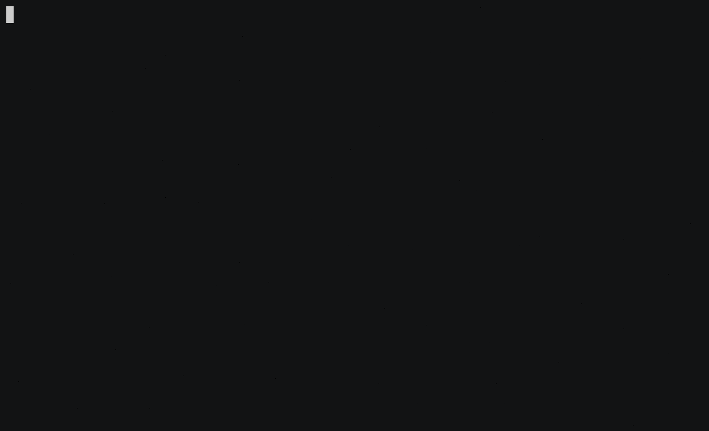
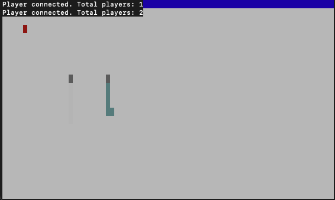

<p align="center">
  
</p>

# Snake Client Project

Snake game is a very popular video game where the player maneuvers a dot and grows it by eating pieces of food. As the snake moves and eats, it grows in size and becomes an obstacle to smooth maneuvers. The goal is to grow the snake as big as possible without bumping into the walls or itself, which leads to the game ending.

This project is a multiplayer version of the Snake game.

## Final Product



## Getting Started

To run the Snake client, you need to have the server-side running. Follow the steps below:

1. Download and install the Snake server from the [server repository](https://github.com/taniarascia/snek).

2. Server Side:
   - Open the terminal and navigate to the `snek-multiplayer` directory.
   - Run the following command to install the dependencies:
     ```
     npm install
     ```
   - Start the server by running the following command:
     ```
     npm run play
     ```

3. Client Side:
   - Open another terminal window or tab.
   - Navigate to the root directory of the Snake client.
   - Run the following command to start the client:
     ```
     node play.js
     ```

Make sure you have Node.js installed on your machine before running the client.

For more detailed instructions on setting up and running the Snake server, please refer to the server repository.

## Features

- Client Setup: Setup server and client and establish connection between the two.
  - Add an event handler to the client that logs "connected..." when a connection is established.

- Connection Module: Create a `client.js` file and move the `connect` function from the `play.js` file to the `connect.js` file (Refactoring code to use a separate module to establish the connection).

- Snake Initials:
  - Register a "connect" event handler on the `connect` function that lets the player know when a connection is established.
  - Send the string "Name: _" to the server upon connection (substitute _ with your initials, e.g., LJ).

- Move Commands:
  - Send the string "Move: up" as data to the server via the `conn` object.
  - Experiment by sending more commands to the server on separate `connect` objects.
  - Supported commands: "Move: down", "Move: left", "Move: right".

- Stdin Setup:
  - Add function `setupInput` to `play.js` with some stdin configuration code.
  - Create a function `handleUserInput` and register it as the "data" callback handler for stdin.

- Input Module: Create an `input.js` file that will act as a separate module to handle user input. This is where the previous two functions created will be moved to.

- WASD Movement: Bind the w, a, s, and d keys to be the up, left, down, right movement keys and let them send messages to the server for the respective movements.

- Sending Messages: Implement some special keys that send canned messages to the server for everyone to see.

- Constants Module: Create a separate file `constants.js` that will export all the constants you are using for the app.

- Stretch: Broadcasting to every client:
  - Create a new feature that sends a message to every client when a new user joins.
  - Display the number of players currently connected.
  - Send a message when a client leaves.


